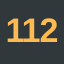
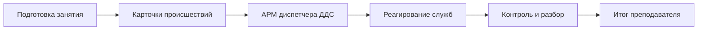
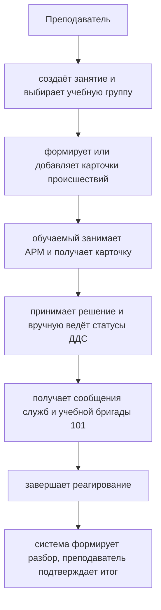
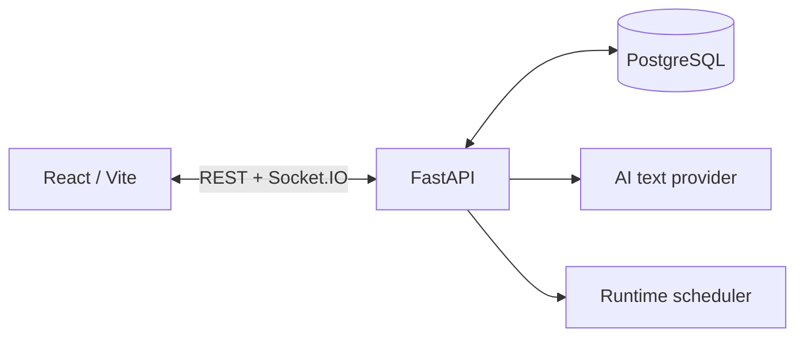

<div align="center">



# Учебный тренажёр 112

**Интерактивный веб-тренажёр для практической подготовки диспетчеров ДДС к работе с карточками происшествий Системы-112.**

<p>
  <a href="https://react.dev/"></a>
  <a href="https://vite.dev/"></a>
  <a href="https://www.python.org/"></a>
  <a href="https://fastapi.tiangolo.com/"></a>
  <a href="https://www.postgresql.org/"></a>
  <a href="https://socket.io/"></a>
  <a href="https://docs.docker.com/compose/"></a>
</p>

### [Открыть онлайн-демонстрацию →](https://112.rzd-learning.ru/)

<p>
  <a href="#о-проекте">О проекте</a> ·
  <a href="#возможности">Возможности</a> ·
  <a href="#попробовать">Попробовать</a> ·
  <a href="#технологии">Технологии</a> ·
  <a href="#архитектура">Архитектура</a>
</p>

</div>

---

## О проекте

Учебный тренажёр моделирует полный учебный цикл диспетчера ДДС: от подготовки занятия и получения карточки происшествия до реагирования служб, фиксации действий обучаемого и итогового разбора преподавателем.

Преподаватель формирует занятие и набор карточек, обучаемые работают на собственных АРМ, а система в реальном времени ведёт состояние происшествий, сообщения служб и историю действий.



## Возможности

- **Подготовка занятий** — группы, режимы выдачи, общий и персональный пул карточек.
- **Генерация карточек происшествий** — на основе методических шаблонов, реальных объектов и вариативных условий.
- **AI генерация** — ИИ формулирует естественный текст учебной карточки до начала занятия.
- **Рабочее место диспетчера** — получение карточки, принятие решения, ручное ведение статусов и работа с сообщениями.
- **Моделирование реагирования** — виртуальные службы и учебные бригады формируют события по ходу сценария.
- **Контроль преподавателя** — мониторинг занятия, история действий и итоговый разбор результатов.
- **Автономное развёртывание** — portable-сборка и Docker-стенд позволяют запускать тренажёр локально, в том числе в учебном классе.

## ИИ в тренажёре

ИИ используется как вспомогательный инструмент подготовки учебного материала. Он формирует вариативный текст карточки происшествия на основе уже заданных условий, объекта и контекста сценария.

При этом классификация происшествия, состав привлекаемых служб, состояние занятия и оценочные правила остаются детерминированными и контролируются backend. AI не выставляет итоговую оценку и не подменяет бизнес-логику тренажёра.

В публичной онлайн-демонстрации AI-генерация включена. Для автономных запусков предусмотрен шаблонный текст, поэтому базовый учебный поток не зависит от внешнего AI API.

---

## Попробовать

### 1. Онлайн-демонстрация — рекомендуемый вариант

Самый быстрый способ познакомиться с MVP — открыть готовый стенд:

**https://112.rzd-learning.ru/**

Ничего устанавливать не требуется. На стенде доступны преподавательский и учебный сценарии, демонстрационные данные и AI-генерация текста карточек происшествий.

### 2. Portable-версия

Portable-сборка предназначена для автономного запуска без установки Python, Node.js и PostgreSQL. Runtime уже находится внутри архива.

Поддерживаемые сборки:

- Windows x64;
- macOS Intel;
- macOS Apple Silicon.

**Как запустить:**

1. Скачайте ZIP для своей платформы на странице [Releases](https://github.com/alex-indi/training-simulator-112/releases).
2. Полностью распакуйте архив.
3. Запустите один файл:
   - Windows — `Start.cmd`;
   - macOS — `Start.command`.
4. Дождитесь завершения автоматической подготовки стенда и откройте адрес, показанный в окне запуска.

Portable-версия сама поднимает локальную PostgreSQL, применяет миграции и подготавливает демонстрационные данные. База и результаты сохраняются между запусками.

### 3. Docker

После клонирования репозитория запустите один файл:

**Windows**

```text
start-demo.cmd
```

**macOS**

```text
start-demo.command
```

**Linux**

```bash
sh ./start-demo.command
```

Launcher проверит Docker/Compose, создаст локальную конфигурацию, сгенерирует пароль базы, поднимет контейнеры, дождётся готовности сервисов и при первом запуске загрузит demo-данные.

После запуска тренажёр доступен по адресу:

**http://localhost:8080**

> [!TIP]
> На Windows и macOS launcher при необходимости подсказывает установку недостающих Docker-компонентов. Если рабочая Docker-среда уже настроена, повторная установка не выполняется.

## Как устроено занятие



Карточки общего пула закрепляются атомарно: первую взятую в работу карточку получает только один обучаемый. Сообщения виртуальных служб не меняют статус ДДС автоматически — обучаемый самостоятельно фиксирует фактические этапы реагирования.

---

## Технологии

| Слой | Технологии |
| --- | --- |
| **Frontend** | React 19, Vite 7, JavaScript, CSS Modules |
| **Backend** | Python 3.12, FastAPI, SQLAlchemy 2, Alembic |
| **Realtime** | Socket.IO |
| **База данных** | PostgreSQL 16 |
| **AI** | OpenAI / OpenAI-compatible provider + deterministic fallback |
| **Развёртывание** | Docker Compose, Nginx, systemd, portable runtime |
| **Качество** | Pytest, Ruff, ESLint, Playwright, GitHub Actions |

## Архитектура



REST хранит каноническое состояние приложения, Socket.IO доставляет клиентам события об изменениях. Для MVP поддерживается один backend process/worker; планировщик дополнительно защищён PostgreSQL advisory lock.

## Структура репозитория

| Каталог | Назначение |
| --- | --- |
| `backend/` | API, бизнес-логика, миграции, seed и тесты |
| `frontend/` | пользовательский интерфейс и E2E |
| `scripts/` | portable build, smoke checks и deployment helpers |
| `deploy/` | production-конфигурация сервера |
| `.github/` | CI/CD и сборка portable-версий |

---

## Статус

Проект находится в состоянии **завершённого MVP**. Реализован сквозной учебный сценарий ДДС 101, преподавательское рабочее место, генерация и библиотека карточек, realtime-взаимодействие, автоматический разбор, публичный стенд, Docker-развёртывание и portable-сборки.

> [!NOTE]
> MVP не является промышленной реализацией Системы-112: demo-аутентификация, учебные виртуальные службы и сценарная модель предназначены для демонстрации и обучения.
