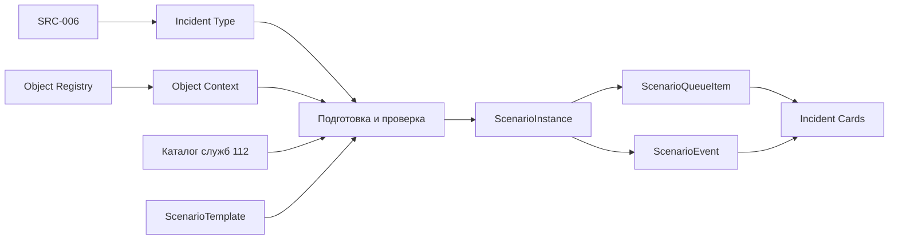
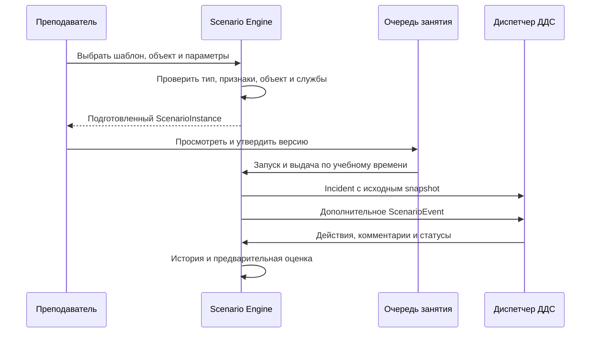

# Концепция Scenario Engine

**Статус:** целевая архитектура. Библиотека шаблонов и подготовка экземпляра реализованы; исполнение экземпляра относится к отдельной задаче.
**Источник требований:** [библиотека и генератор сценариев](scenario-library-and-generator.md).

## Назначение

Scenario Engine готовит проверяемую учебную ситуацию для диспетчера ДДС, выдаёт карточки и исполняет события. SRC-006 определяет тип и признаки происшествия, Object Registry — контекст места, каталог служб — допустимые службы. Шаблон задаёт методический замысел, а движок фиксирует конкретный экземпляр для занятия.

Полный подбор служб в будущем учитывает признаки происшествия, район обслуживания и подчинённость объекта. Пока RoutingEngine не реализован, экземпляр может хранить заранее проверенный список оповещения. Классификатор не задаёт учебный сюжет или алгоритм действий ДДС; объект сам по себе не определяет тип происшествия и состав служб.

## Сущности

### `ScenarioTemplate`

Повторно используемый шаблон, например «Пожар в образовательном учреждении». Содержит тип происшествия, сложность, допустимые типы и характеристики объектов, обязательные признаки, правила выбора служб, набор событий, учебную цель и критерии оценки. Автор и версия позволяют проследить происхождение экземпляра. Шаблон можно изменять для будущих занятий; уже подготовленные экземпляры не пересчитываются скрыто.

### `ScenarioInstance`

Конкретный подготовленный сценарий занятия, например «Пожар в школе № 1250, занятие 01.10.2026». Он фиксирует версию шаблона, выбранный объект и его значимые атрибуты, тип и признаки происшествия, сложность, проверенные службы, исходные карточки, план событий и критерии оценки. Ссылки на источники сохраняются для прослеживаемости, а использованные значения копируются в snapshot. Последующий импорт справочника не меняет учебный факт задним числом.

До запуска преподаватель может изменить, заменить или перегенерировать подготовку. Правка создаёт новую версию и снимает утверждение позиции очереди; новую версию нужно проверить и утвердить. **После запуска занятия содержимое экземпляра неизменно.** Во время занятия преподаватель может добавить отдельное событие с автором и серверным временем, не переписывая исходный план. Режим `RANDOM` меняет только порядок выдачи утверждённых экземпляров.

### `ScenarioEvent`

Событие развития ситуации имеет тип, данные, адресата и момент `T+` относительно учебного времени: `T+0` — первичное сообщение, `T+5` — появление пострадавшего, `T+10` — изменение обстановки. Оно может дополнить сведения карточки, отправить сообщение виртуальной группы или изменить состояние её назначения. Событие не выполняет действие за обучаемого и не меняет статус ДДС автоматически.

Плановые события хранятся в неизменном плане экземпляра; факт исполнения — отдельно с серверным временем и результатом. Повторный тик не исполняет одно событие дважды. Глобальная пауза останавливает события всем, личная — соответствующему участнику. Ручное событие преподавателя сохраняется отдельно от исходного плана и действий обучаемого.

### `Incident`

Карточка, доставленная одному `TrainingRun` или общей группе из утверждённого экземпляра. При выдаче исходное содержимое копируется в `Incident.source_snapshot`; дальнейшие сведения и действия добавляются в историю. Один экземпляр может породить несколько карточек, а один `TrainingRun` за смену обрабатывает много карточек. Для общей очереди владелец определяется атомарным claim.

## Взаимодействие

Backend хранит каноническое состояние через REST; Socket.IO сообщает об изменениях, после reconnect клиент перечитывает REST. События первого этапа детерминированы и подготовлены до занятия. Серверное учебное время учитывает паузы. Состояние виртуальной группы и статус карточки ДДС независимы: диспетчер меняет статус сам на основании полученной информации.

Критерии шаблона и факты экземпляра сопоставляются с `IncidentAction`, сообщениями и исполненными событиями. Проверяются время, обязательные действия и комментарии, порядок этапов и реакция на изменение обстановки. Пропуск или преждевременный статус оценивается как ошибка, а не обязательно запрещается API. Автоматическая оценка предварительна; итог утверждает преподаватель. Будущие события и скрытые критерии недоступны обучаемому до разбора.

## Соотношение с текущим кодом

Учебные сценарии в коде называются `TrainingScenario`, чтобы не смешивать их с техническими «сценариями реагирования» Системы-112. Сейчас `TrainingScenario` хранит подготовленный `snapshot`, `ScenarioQueueItem` — его копию, утверждение и состояние выдачи, а `Incident.source_snapshot` — выданную карточку. `ScenarioTemplate` и `ScenarioInstance` уже существуют как отдельные таблицы. `ScenarioInstanceEvent` фиксирует план событий экземпляра, но ещё не исполняет его. Связь экземпляра с очередью и материализация в `Incident` входят в UT112-27.

Будущая схема должна сохранить совместимость с подготовленными карточками: связать версию шаблона, snapshot экземпляра, план и факт исполнения событий, затем выполнять миграцию отдельной задачей. AI может предлагать тексты и варианты, но результат проходит проверку по справочникам, правилам и утверждение преподавателем.
