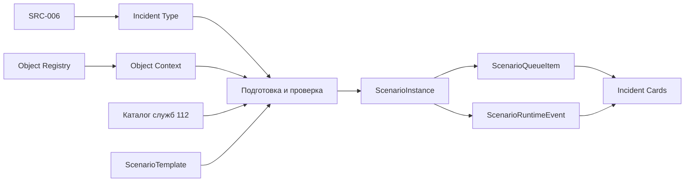
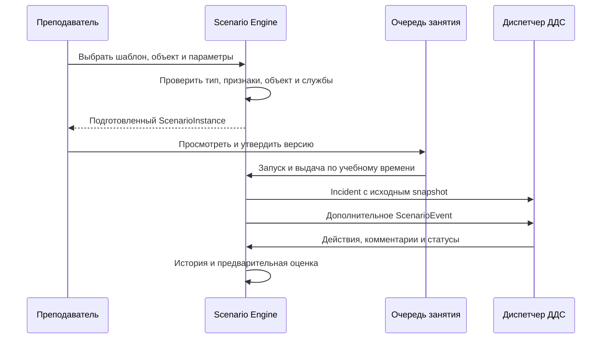

# Концепция Scenario Engine

**Статус:** целевая модель исполнения; очередь экземпляра, выдача `Incident` и выпуск подготовленных событий реализованы. Подготовка по группам до подключения АРМ остаётся [целевым workflow](instructor-preparation-workflow.md).
**Источник требований:** [библиотека и генератор сценариев](scenario-library-and-generator.md).

## AI Text Rendering

При подготовке `ScenarioInstance` проверенные факты исходной карточки и события `RESPONSE_MESSAGE` передаются в `AITextRenderer`. Он выбирает провайдер по конфигурации: OpenAI, OpenAI-compatible endpoint локальной модели или детерминированный шаблон. Результат и metadata (`provider`, `model`, `prompt_version`, `input_hash`, usage, fallback) сохраняются отдельно от исходных фактов в JSON snapshot. Генерация не вызывается во время занятия.

```text
Domain data → AITextRenderer → TextGenerationProvider
                              ├ OpenAI
                              ├ OpenAI-compatible local LLM
                              └ deterministic template fallback
```

Преподаватель видит факты и текст, может перегенерировать или вручную отредактировать его до `CONFIRMED`. Ручная правка помечается `MANUAL`; после подтверждения текст и факты неизменяемы. Runtime использует сохранённый текст для Incident и сообщений группы. AI — слой представления, не источник бизнес-логики, классификации, выбора служб или оценки.

## Назначение

Scenario Engine готовит проверяемую учебную ситуацию для диспетчера ДДС, выдаёт карточки и исполняет события. SRC-006 определяет тип и признаки происшествия, Object Registry — контекст места, каталог служб — допустимые службы. Шаблон задаёт методический замысел, а движок фиксирует конкретный экземпляр для занятия.



Полный подбор служб в будущем учитывает признаки происшествия, район обслуживания и подчинённость объекта. Пока RoutingEngine не реализован, экземпляр может хранить заранее проверенный список оповещения. Классификатор не задаёт учебный сюжет или алгоритм действий ДДС; объект сам по себе не определяет тип происшествия и состав служб.

## Сущности

### `ScenarioTemplate`

Повторно используемый шаблон, например «Пожар в образовательном учреждении». Содержит тип происшествия, сложность, допустимые типы и характеристики объектов, обязательные признаки, правила выбора служб, набор событий, учебную цель и критерии оценки. Автор и версия позволяют проследить происхождение экземпляра. Шаблон можно изменять для будущих занятий; уже подготовленные экземпляры не пересчитываются скрыто.

### `ScenarioInstance`

Конкретный подготовленный сценарий занятия, например «Пожар в школе № 1250, занятие 01.10.2026». Он фиксирует версию шаблона, выбранный объект и его значимые атрибуты, тип и признаки происшествия, сложность, проверенные службы, исходные карточки, план событий и критерии оценки. Ссылки на источники сохраняются для прослеживаемости, а использованные значения копируются в snapshot. Последующий импорт справочника не меняет учебный факт задним числом.

До запуска преподаватель может изменить, заменить или перегенерировать подготовку. Правка создаёт новую версию и снимает утверждение позиции очереди; новую версию нужно проверить и утвердить. **После запуска занятия содержимое экземпляра неизменно.** Во время занятия преподаватель может добавить отдельное событие с автором и серверным временем, не переписывая исходный план. Режим `RANDOM` меняет только порядок выдачи утверждённых экземпляров.

### `ScenarioEvent`

Событие развития ситуации имеет тип, данные, адресата и момент `T+` относительно учебного времени: `T+0` — первичное сообщение, `T+5` — появление пострадавшего, `T+10` — изменение обстановки. Оно может дополнить сведения карточки, отправить сообщение виртуальной группы или изменить состояние её назначения. Событие не выполняет действие за обучаемого и не меняет статус ДДС автоматически.

Плановые события хранятся в неизменном плане экземпляра; факт исполнения — отдельно с серверным временем и результатом. Повторный тик не исполняет одно событие дважды. Глобальная пауза останавливает события всем, личная — соответствующему участнику. Ручное событие преподавателя сохраняется отдельно от исходного плана и действий обучаемого.

### `Incident`

Карточка, доставленная одному `TrainingRun` или общей группе из утверждённого экземпляра. При выдаче исходное содержимое копируется в `Incident.source_snapshot`; дальнейшие сведения и действия добавляются в историю. Текущая схема связывает один экземпляр с одной целевой очередью и одним первичным `Incident`; для нескольких независимых карточек готовят отдельные экземпляры. Один `TrainingRun` за смену обрабатывает много карточек. Для общей очереди владелец определяется атомарным claim.

## Взаимодействие



Backend хранит каноническое состояние через REST; Socket.IO сообщает об изменениях, после reconnect клиент перечитывает REST. События первого этапа детерминированы и подготовлены до занятия. Серверное учебное время учитывает паузы. Состояние виртуальной группы и статус карточки ДДС независимы: диспетчер меняет статус сам на основании полученной информации.

Критерии шаблона и факты экземпляра сопоставляются с `IncidentAction`, сообщениями и исполненными событиями. Проверяются время, обязательные действия и комментарии, порядок этапов и реакция на изменение обстановки. Пропуск или преждевременный статус оценивается как ошибка, а не обязательно запрещается API. Автоматическая оценка предварительна; итог утверждает преподаватель. Будущие события и скрытые критерии недоступны обучаемому до разбора.

## Соотношение с текущим кодом

Учебные сценарии в коде называются `TrainingScenario`, чтобы не смешивать их с техническими «сценариями реагирования» Системы-112. `POST /api/scenario-instances/{id}/materialize` создаёт связанную позицию `ScenarioQueueItem` до старта занятия. Её утверждают и выдают существующим механизмом `FIXED_SET`/`FLOW`/`MANUAL`. При выдаче создаётся канонический `Incident` с видимым начальным snapshot и `ScenarioRuntimeEvent` для каждого будущего события. Тот же серверный тик выпускает события с учётом глобальной и личной паузы. План и `released_at` доступны преподавателю через `GET /api/scenario-instances/{id}/materialization`; обучаемый получает только выпущенные сведения через карточку и чат. `ScenarioEvent.origin` отличает плановое событие от вводной преподавателя. `IncidentAction` и статус ДДС события не изменяют.

Для `RESPONSE_MESSAGE` автор шаблона выбирает одну службу из служб сценария. Без адресата шаблон нельзя перевести в `READY`. Выбранная служба сохраняется в snapshot экземпляра. При назначении виртуальной группы на карточку обучаемый указывает службу сценария. Плановое сообщение попадает в чат назначения этой службы; если назначения ещё нет, событие остаётся `PENDING` и выпускается при следующем серверном тике после назначения. Повторный тик не создаёт дубликат сообщения. Миграция подставляет службу в существующие шаблоны и экземпляры только при единственном однозначном варианте; готовые шаблоны с неоднозначным адресатом возвращаются в `DRAFT` для уточнения.

Адресное `RESPONSE_MESSAGE` может также содержать следующий этап виртуальной группы: подтверждение задания, выезд, прибытие, работа или завершение. Готовность шаблона проверяет порядок этапов отдельно для каждой службы. Сервер применяет переход и отправляет сообщение при выпуске события, затем уведомляет клиент об изменении состояния группы. Если преподаватель уже перевёл группу на этот или более поздний этап, событие доставляет сообщение без возврата состояния назад. Статус карточки ДДС при этом не меняется.

Будущая схема должна сохранить совместимость с подготовленными карточками: связать версию шаблона, snapshot экземпляра, план и факт исполнения событий, затем выполнять миграцию отдельной задачей. AI может предлагать тексты и варианты, но результат проходит проверку по справочникам, правилам и утверждение преподавателем.
