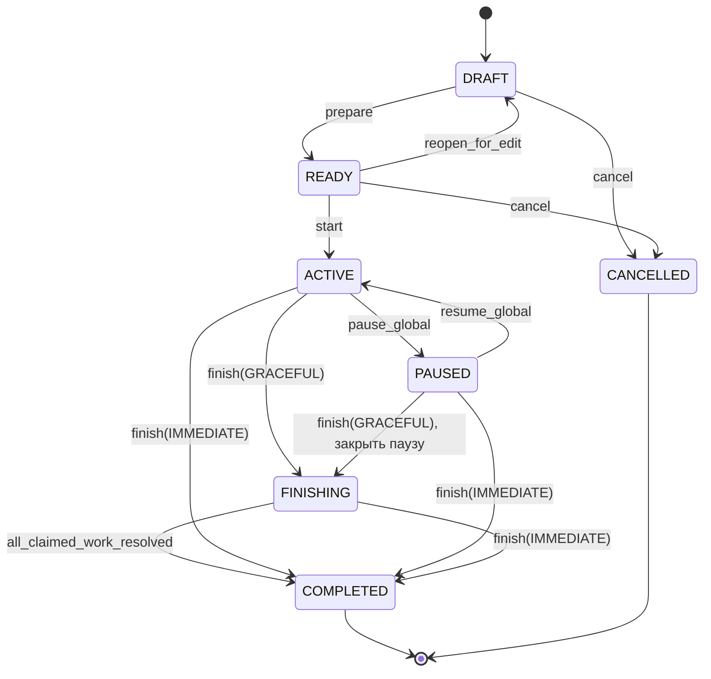
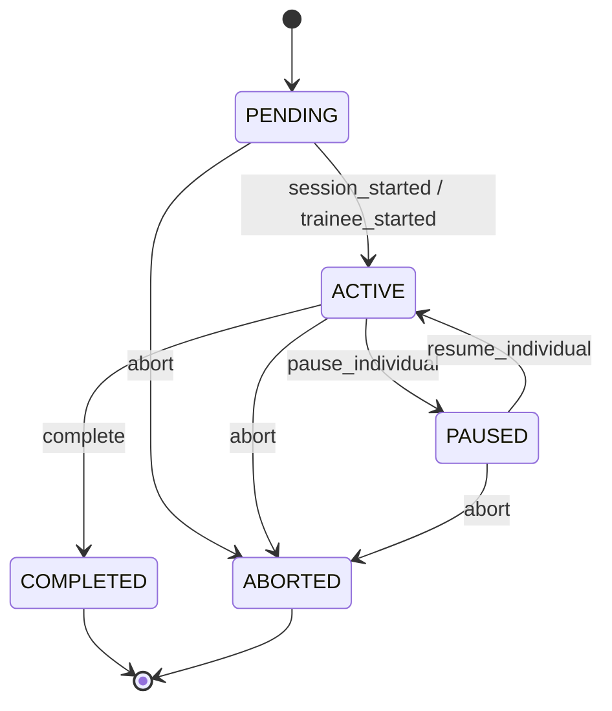
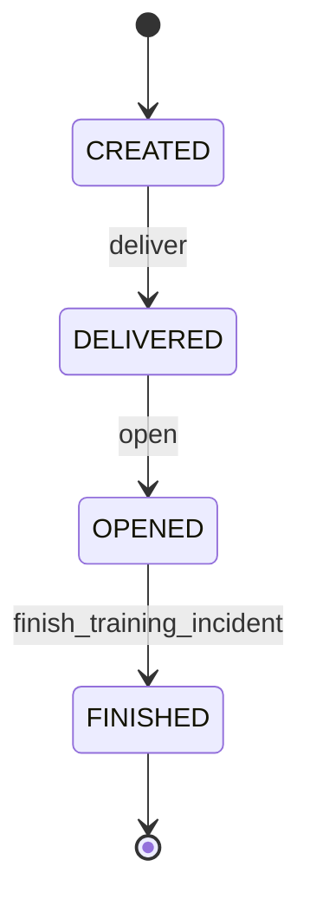
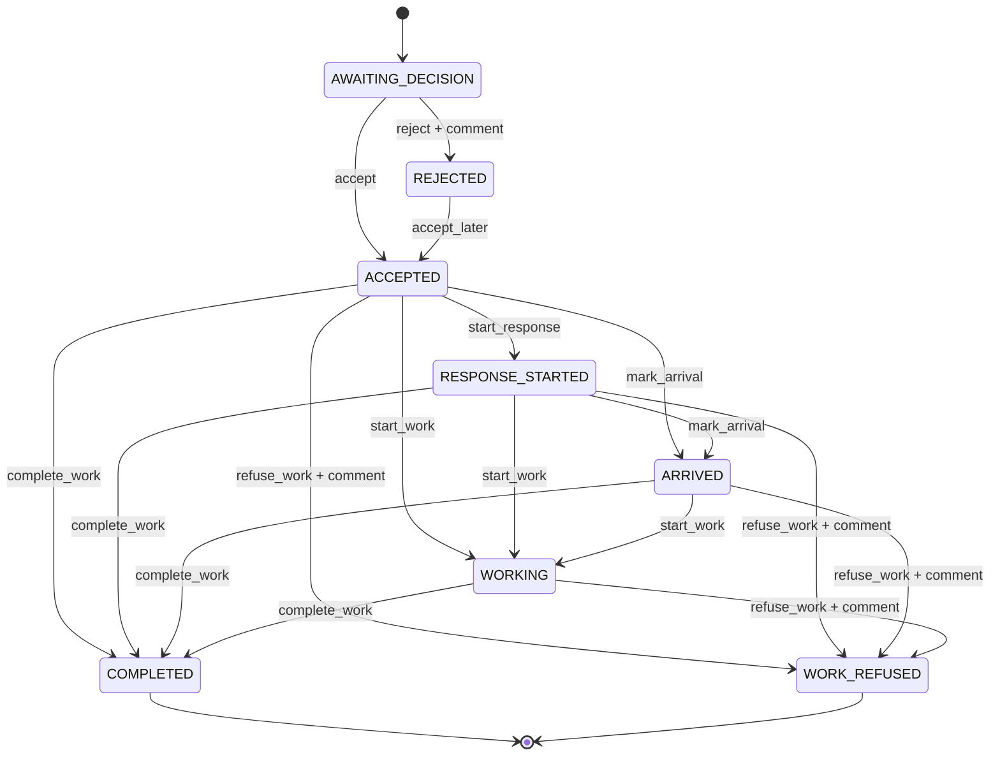
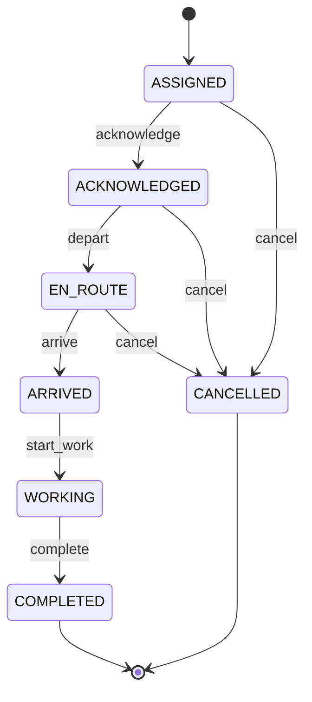

# State Machines

**Версия:** 0.3
**Дата:** 22.09.2026
**Статус:** WORKING BASELINE

## Назначение

Документ фиксирует текущие автоматы карточки и модель учебной смены по [концепции кабинета преподавателя](instructor-workspace-concept.md). В коде логические состояния `PAUSED` и `FINISHING` представлены полями `paused_at` и `finish_mode=GRACEFUL` при сохранённом `TrainingSession.state=ACTIVE`. Индивидуальная пауза представлена `TrainingRun.paused_at`; отдельного enum состояния `TrainingRun` пока нет.

Главная цель — не смешивать несколько разных состояний в одно поле `status`.

В целевой модели существуют шесть независимых состояний/автоматов:

```text
TrainingSession state
TrainingRun state
Incident lifecycle
System-112 card status
DDS response status
ResponseAssignment state
```

Они связаны событиями, но не должны автоматически подменять друг друга.

## Обозначения

- `CONFIRMED` — подтверждено заказчиком или профильными материалами;
- `PRODUCT_DECISION` — принято командой для MVP;
- `OPEN` — деталь ещё требует уточнения.

Названия enum ниже являются техническими именами продукта. Русские названия в интерфейсе должны соответствовать предметной терминологии.

---

# 1. TrainingSession

`PRODUCT_DECISION`.

`TrainingSession` — всё занятие/учебная смена преподавателя: настройки, группы, участники, подготовленные сценарии, расписание, паузы и завершение. Один участник получает множество карточек в рамках одной смены.

## Состояния

Диаграмма ниже показывает логические состояния. Физический enum БД хранит `DRAFT`, `READY`, `ACTIVE`, `COMPLETED`, `CANCELLED`; пауза и плавное завершение хранятся отдельными полями.

```text
DRAFT
READY
ACTIVE
PAUSED
FINISHING
COMPLETED
CANCELLED
```

| State | Смысл |
| --- | --- |
| `DRAFT` | Занятие создано, его настройки ещё можно изменять. |
| `READY` | Занятие подготовлено к запуску. |
| `ACTIVE` | Идёт учебное время; возможны выдача и сценарные события. |
| `PAUSED` | Глобальная пауза: учебное время, новая выдача, нормативы и сценарные события остановлены. |
| `FINISHING` | Запущено `GRACEFUL` завершение: новых карточек нет, уже взятые можно закончить. |
| `COMPLETED` | Занятие завершено; режим завершения `GRACEFUL` или `IMMEDIATE` сохранён отдельно. |
| `CANCELLED` | Черновик/подготовленное занятие отменено до запуска. |

## Переходы



## Правила

- `start` создаёт/активирует `TrainingRun` назначенных обучаемых и фиксирует состав групп, профиль ДДС каждого участника, режим, порядок и утверждённый пул сценариев; после старта эти данные не меняются задним числом;
- `PAUSED` останавливает учебные часы и выдачу всем, замораживает нормативы и сценарные события; `resume_global` продолжает их с сохранённого места, не включая время паузы в учебные просрочки;
- `FINISHING` прекращает любую новую выдачу, включая ручную; незахваченные общие карточки больше не назначаются, а взятые карточки разрешено завершить;
- `IMMEDIATE` прекращает занятие без ожидания взятых карточек; незавершённые `TrainingRun` и карточки сохраняются в истории с признаком досрочного прекращения, а не удаляются;
- начало, паузы, resume, режим завершения и завершение журналируются с серверным временем.

---

# 2. TrainingRun

`PRODUCT_DECISION`.

`TrainingRun` — участие одного обучаемого **во всём** `TrainingSession`; это не `Incident` и не одно выполнение `TrainingScenario`. Один `TrainingRun` может содержать много карточек. АРМ и профиль ДДС относятся к этому участию; профиль не меняется в активной смене.

## Состояния

```text
PENDING
ACTIVE
PAUSED
COMPLETED
ABORTED
```

| State | Смысл |
| --- | --- |
| `PENDING` | Прохождение создано, но ещё не началось. |
| `ACTIVE` | Обучаемый выполняет занятие; новые карточки поступают согласно настройкам смены. |
| `PAUSED` | Индивидуальная пауза: личные нормативы и выдача остановлены, остальные участники продолжают работу. |
| `COMPLETED` | Индивидуальное прохождение завершено. |
| `ABORTED` | Прохождение досрочно прекращено, например при `IMMEDIATE`. История сохраняется. |

## Переходы



Глобальная пауза **не переводит** каждый `TrainingRun` в `PAUSED`: состояние сессии блокирует весь класс, а `TrainingRun.PAUSED` означает только личную паузу. Персональный `PAUSED` может существовать до и после глобальной паузы. Учебное время участника исключает объединение пересекающихся интервалов обеих пауз ровно один раз. Личная пауза хранит причину, автора, серверные начало/конец и длительность; она не останавливает других обучаемых. `TrainingSession.COMPLETED` не удаляет и не пересчитывает историю `TrainingRun`.

Новые карточки не выдаются `TrainingRun.PAUSED`; его уже взятые карточки сохраняются. При `TrainingSession.FINISHING` активный участник может завершать взятые карточки без новой выдачи. Когда все выданные личные и захваченные общие карточки имеют конечный статус, сервер переводит занятие в `COMPLETED`. При `IMMEDIATE` незавершённые карточки сохраняются в истории; отдельный статус `ABORTED` у `TrainingRun` пока не хранится.

---

# 3. Incident lifecycle

Это **технический жизненный цикл учебной карточки**, а не статус реагирования ДДС и не общий статус реальной карточки Системы-112.

`PRODUCT_DECISION`.

## Состояния

```text
CREATED
DELIVERED
OPENED
FINISHED
```

| State | Смысл |
| --- | --- |
| `CREATED` | Карточка создана внутри `Virtual112`, но ещё не доставлена обучаемому. |
| `DELIVERED` | Карточка поступила в рабочее место обучаемого. |
| `OPENED` | Обучаемый открыл карточку. |
| `FINISHED` | Учебная обработка этой карточки завершена. |

## Переходы



## Временные метки

Сервер фиксирует минимум:

```text
created_at
delivered_at
opened_at
finished_at
```

`primary_status_at` хранится отдельно и относится к автомату статуса ДДС.

## Важно

`IncidentLifecycleState.FINISHED` не должен использоваться вместо предметного `Работы завершены`.

Например, корректное `Не принята` также может завершить учебную обработку карточки, хотя никакого статуса `Работы завершены` не было.

`CONFIRMED (SRC-002)` — карточка из ВИС может поступить с неполным набором исходных полей, а после доработки ВИС её список оповещения может расшириться. Эти изменения являются событиями карточки и не сбрасывают её технический lifecycle.

---

# 3.1. Общий статус карточки Системы-112

Это отдельное состояние реальной карточки, которое отражает работу Службы 112, главного специалиста и всех оповещённых служб. Оно не равно статусу реагирования текущей ДДС.

`CONFIRMED (SRC-002)`:

```text
REGISTERED
PROCESSED
VERIFIED
NOT_NOTIFIED
REFUSAL
NOT_COMPLETED
FINISHED
```

| Enum | UI | Условие / смысл |
| --- | --- | --- |
| `REGISTERED` | `Зарегистрирована` | Карточка сохранена в ПОВ-112. |
| `PROCESSED` | `Отработана` | Необходимые звонки завершены либо голосовое оповещение не требуется; только для карточек, созданных или обработанных Службой 112. |
| `VERIFIED` | `Проверена` | Работа специалиста-112 проверена главным специалистом. |
| `NOT_NOTIFIED` | `Не оповещено` | Есть служба без своевременного `Принята` / `Не принята`. |
| `REFUSAL` | `Отказ` | Есть `Не принята` / `Отказ от выполнения работ`, и карточка проверена главным специалистом. |
| `NOT_COMPLETED` | `Не завершено` | Прошло более 48 часов, а есть служба без `Работы завершены`. |
| `FINISHED` | `Завершена` | Все службы установили `Работы завершены` либо список оповещения пуст. |

`PRODUCT_DECISION` — в тренажере это отдельная проекция `System112CardStatus`. На первом vertical slice она может быть вычисляемой/демонстрационной и не обязана воспроизводить весь реальный workflow контроля, но её нельзя заменять `IncidentLifecycleState.FINISHED` или последним `DdsResponseStatus`.

---

# 4. Статус реагирования ДДС

Это основной предметный автомат действий обучаемого.

## Подтверждённые предметные статусы

`CONFIRMED`:

- `Принята`;
- `Не принята`;
- `Начало реагирования`;
- `Прибытие`;
- `Проведение работ`;
- `Работы завершены`;
- `Отказ от выполнения работ`.

`CONFIRMED (SRC-002)` — в истории службы также существуют системные события:

- `Добавлена` — система автоматически добавила службу при сохранении карточки;
- `Получена службой` — карточка поступила на сервер интегрированной службы или была открыта диспетчером на АРМ-112.

Эти события не являются действиями обучаемого и не входят в `available_actions`, но хранятся в общей хронологии службы.

## Технические enum MVP

Системные события истории службы:

```text
SERVICE_ADDED
SERVICE_RECEIVED
```

Пользовательский operational status:

```text
AWAITING_DECISION
ACCEPTED
REJECTED
RESPONSE_STARTED
ARRIVED
WORKING
COMPLETED
WORK_REFUSED
```

| Enum | UI / предметный смысл |
| --- | --- |
| `AWAITING_DECISION` | Внутреннее состояние: первичное решение ещё не принято. |
| `ACCEPTED` | `Принята`. |
| `REJECTED` | `Не принята`. |
| `RESPONSE_STARTED` | `Начало реагирования`. |
| `ARRIVED` | `Прибытие`. |
| `WORKING` | `Проведение работ`. |
| `COMPLETED` | `Работы завершены`. |
| `WORK_REFUSED` | `Отказ от выполнения работ`. |

`SERVICE_ADDED` и `SERVICE_RECEIVED` относятся к `DdsServiceEventType`; остальные значения — к `DdsResponseStatus`. Их объединяет хронология `IncidentAction`, а не одно поле текущего состояния.

## Базовый flow и доступность действий

`CONFIRMED (SRC-002)` — первичное решение выбирается из `Принята` / `Не принята`; после `Не принята` доступна `Принята`; после `Принята` реальный АРМ показывает все дальнейшие статусы. Источник не подтверждает строгую обязательную цепочку backend-переходов между промежуточными статусами.

`PRODUCT_DECISION` — канонический успешный путь остаётся ориентиром сценария, но не техническим ограничением API:



## Правила переходов

### Системные события до первичного решения

`CONFIRMED (SRC-002)`.

Нормальная история службы начинается так:

```text
SERVICE_ADDED
→ SERVICE_RECEIVED
→ ACCEPTED / REJECTED
```

`SERVICE_ADDED` и `SERVICE_RECEIVED` создаёт backend от имени системы. Диспетчер не может отправить эти команды вручную.

30-секундный норматив для `ACCEPTED` / `REJECTED` считается от времени направления карточки в службу (`SERVICE_ADDED` / `delivered_at`), а не от `SERVICE_RECEIVED` или `opened_at`.

### `AWAITING_DECISION → ACCEPTED`

`CONFIRMED`.

Обучаемый решил, что служба будет реагировать.

Backend фиксирует `primary_status_at`, если это первый первичный статус.

`primary_status_at - delivered_at` используется для оценки 30-секундного норматива.

### `AWAITING_DECISION → REJECTED`

`CONFIRMED`.

Требуется комментарий с обоснованием.

Команда отклоняется backend, если обязательный комментарий отсутствует.

### `REJECTED → ACCEPTED`

`CONFIRMED`.

Материалы допускают последующее принятие карточки после первоначального `Не принята`.

История не перезаписывается: оба действия должны остаться в `IncidentAction`.

### `ACCEPTED → RESPONSE_STARTED`

`CONFIRMED` по смыслу статуса.

Действие выполняется обучаемым на основании фактической информации о начале реагирования.

Для MVP эта информация обычно приходит от виртуального старшего группы реагирования через чат.

### Дальнейшие статусы после `ACCEPTED`

`CONFIRMED (SRC-002)` — после `Принята` интерфейс предоставляет `Начало реагирования`, `Прибытие`, `Проведение работ`, `Работы завершены` и `Отказ от выполнения работ`.

`PRODUCT_DECISION` — backend разрешает добавить любой ещё не зафиксированный дальнейший статус до терминального действия. Он не требует, чтобы перед `Прибытие` обязательно уже было записано `Начало реагирования`, а перед `Работы завершены` — все промежуточные этапы.

Пропуск, преждевременное действие или нарушение ожидаемого порядка не теряется: `Assessment` сравнивает полную историю `IncidentAction` с событиями `TrainingScenario` и формирует учебную ошибку.

Backend при этом продолжает проверять:

- наличие исходного `ACCEPTED`;
- отсутствие дубликата того же действия;
- отсутствие терминального статуса;
- роль пользователя и обязательный комментарий.

### `COMPLETED`

`CONFIRMED (SRC-002)`.

Перед завершением вся существенная итоговая информация сценария должна быть отражена в комментариях, если этого требует сценарий/правило.

Сохранение статуса закрывает карточку для обычного редактирования.

### `WORK_REFUSED`

`CONFIRMED (SRC-002)` — статус доступен после `Принята`, в том числе для исправления ошибочной `Принята`, когда реагирования не будет.

Предметный смысл: реагирование началось, но работы не выполнялись.

Комментарий обязателен и должен содержать причину отказа и итоги работы диспетчера с происшествием, включая передачу информации другой службе, если она была.

Сохранение статуса закрывает карточку для обычного редактирования.

## Терминальные состояния

Для operational status:

```text
COMPLETED
WORK_REFUSED
```

`REJECTED` не считается безусловно терминальным, поскольку подтверждён переход `Не принята → Принята`.

`CONFIRMED (SRC-002)` — ошибочные `COMPLETED` и `WORK_REFUSED` исправляются только через отдел контроля реагирования. Обычная команда редактирования после них недоступна.

Учебный сценарий может закончить карточку в `REJECTED`, если именно отказ является ожидаемым правильным результатом. Это определяется `TrainingScenario`, а не самим enum.

## `available_actions`

Frontend не строит transition table самостоятельно.

Пример:

```json
{
  "dds_status": "ARRIVED",
  "available_actions": [
    "START_RESPONSE",
    "START_WORK",
    "COMPLETE_WORK",
    "REFUSE_WORK"
  ]
}
```

Backend учитывает:

- наличие `ACCEPTED`, уже записанные действия и отсутствие терминального статуса;
- роль пользователя;
- обязательность комментария;
- состояние учебного сценария;
- дополнительные policy конкретного профиля, если они появятся позднее.

После `ACCEPTED` пример ответа может включать одновременно:

```json
{
  "dds_status": "ACCEPTED",
  "available_actions": [
    "START_RESPONSE",
    "MARK_ARRIVAL",
    "START_WORK",
    "COMPLETE_WORK",
    "REFUSE_WORK"
  ]
}
```

Это повторяет доступность реального АРМ. Правильность выбранного действия в текущий момент оценивается отдельно.

---

# 5. ResponseAssignment

`ResponseUnit` — виртуальная группа реагирования как сущность/идентичность.

`ResponseAssignment` — участие конкретной группы в конкретной карточке.

**Runtime state хранится на `ResponseAssignment`.**

Это решение уточняет раннюю формулировку «состояние ResponseUnit» в проектной документации.

## Состояния

```text
ASSIGNED
ACKNOWLEDGED
EN_ROUTE
ARRIVED
WORKING
COMPLETED
CANCELLED
```

| State | Смысл виртуальной группы |
| --- | --- |
| `ASSIGNED` | Группа назначена на происшествие. |
| `ACKNOWLEDGED` | Старший группы подтвердил получение задачи. |
| `EN_ROUTE` | Группа выехала. |
| `ARRIVED` | Группа прибыла. |
| `WORKING` | Группа выполняет работы. |
| `COMPLETED` | Группа завершила работы. |
| `CANCELLED` | Назначение отменено / прекращено сценарием. |

## Базовый flow



## Кто меняет состояние

Не обучаемый напрямую.

Состояние меняет движок виртуальной группы на основании `TrainingScenarioEvent` или будущего runtime-механизма сценария.

Пример:

```text
+00:20 ACKNOWLEDGED
+01:00 EN_ROUTE
+04:00 ARRIVED
+05:00 WORKING
+10:00 COMPLETED
```

Переход обычно создаёт `ResponseMessage`.

Например:

```text
EN_ROUTE
→
«Выехали на место происшествия»
```

## Критическое правило независимости

```text
ResponseAssignment.EN_ROUTE
```

**не вызывает автоматически**:

```text
DdsResponseStatus.RESPONSE_STARTED
```

Правильный путь:

```text
ResponseAssignment.EN_ROUTE
        ↓
ResponseMessage: «Выехали»
        ↓
обучаемый читает сообщение
        ↓
обучаемый выбирает «Начало реагирования»
        ↓
backend проверяет команду
        ↓
DdsResponseStatus.RESPONSE_STARTED
```

Именно разница между фактическим миром сценария и действиями обучаемого используется в Assessment.

---

# 6. ResponseMessage

Отдельный state machine для сообщения в первом MVP не нужен.

Сообщение считается неизменяемым фактом истории.

Минимум:

```text
id
response_assignment_id
sender_type
body
created_at
```

`sender_type`:

```text
DISPATCHER
RESPONSE_UNIT
SYSTEM
```

Для контроля чтения при необходимости добавляется `read_at` или отдельное событие `RESPONSE_MESSAGE_READ`, но текст сообщения после создания не редактируется.

## Два подтверждённых режима коммуникации

Заказчик описал оба варианта:

### Push

```text
старший группы
→ звонит/сообщает в ДДС
→ докладывает обстановку
```

В MVP:

```text
Virtual Response Unit
→ ResponseMessage
→ чат обучаемого
```

### Pull

```text
диспетчер
→ сам связывается со старшим группы
→ уточняет ход работ
```

В MVP обучаемый должен иметь действие вроде:

```text
[Запросить состояние]
```

или возможность отправить сообщение в чат.

Сценарий может намеренно не присылать следующий доклад, пока обучаемый сам не проявит инициативу.

---

# 7. Связь автоматов

Нормальный успешный пример:

```text
Incident.DELIVERED
        ↓
Incident.OPENED
        ↓
DdsResponseStatus.ACCEPTED
        ↓
ResponseAssignment.ASSIGNED
        ↓
ResponseAssignment.ACKNOWLEDGED
        ↓
ResponseAssignment.EN_ROUTE
        ↓
сообщение «Выехали»
        ↓
DdsResponseStatus.RESPONSE_STARTED
        ↓
ResponseAssignment.ARRIVED
        ↓
сообщение «Прибыли»
        ↓
DdsResponseStatus.ARRIVED
        ↓
ResponseAssignment.WORKING
        ↓
сообщение «Приступили к работам»
        ↓
DdsResponseStatus.WORKING
        ↓
ResponseAssignment.COMPLETED
        ↓
сообщение «Работы завершены»
        ↓
DdsResponseStatus.COMPLETED
        ↓
Incident.FINISHED
```

Но это **не автоматическая цепочка**. Между событиями группы и статусами ДДС всегда существует действие обучаемого.

---

# 8. Assessment и state machines

Assessment сравнивает два потока времени:

```text
фактические события сценария
vs
действия обучаемого
```

Пример:

```text
14:04:00 ResponseAssignment → EN_ROUTE
14:04:01 ResponseMessage «Выехали»
14:04:18 Trainee → RESPONSE_STARTED
```

Можно вычислить:

```text
reaction_delay = 17 seconds
```

Примеры детерминированных ошибок:

- обучаемый поставил `ARRIVED`, когда группа только `EN_ROUTE`;
- группа сообщила о прибытии, но обучаемый не изменил статус;
- обучаемый сразу установил поздний статус и пропустил необходимый по сценарию промежуточный этап;
- обучаемый зафиксировал статусы в порядке, не соответствующем фактическому ходу реагирования;
- `REJECTED` установлен без комментария;
- `WORK_REFUSED` установлен без комментария;
- к промежуточному статусу отсутствует значимый комментарий, который требовал сценарий;
- обучаемый завершил работу до сообщения о фактическом завершении;
- сценарий требовал инициативного запроса, но обучаемый его не сделал.

AI для таких проверок не нужен.

---

# 9. Атомарность и история

Каждая предметная команда backend должна атомарно:

1. проверить текущий state;
2. проверить `available_actions`/policy;
3. проверить обязательные входные данные;
4. изменить текущее состояние;
5. записать `IncidentAction`;
6. сохранить серверную временную метку;
7. после успешного commit отправить realtime-уведомление.

Недопустимо сначала отправить Socket.IO-событие, а затем обнаружить, что изменение БД не сохранилось.

---

# 10. Конкурентность и повторные команды

Frontend может повторить запрос после reconnect или двойного клика.

Для критичных команд backend должен защищаться от:

- повторного выполнения одного и того же перехода;
- перехода из устаревшего состояния;
- параллельного изменения карточки двумя запросами.

Конкретный механизм optimistic locking / idempotency key выбирается при реализации соответствующего endpoint и не фиксируется этим документом.

---

# 11. Что пока не моделируем

В первый vertical slice не добавлять без отдельной задачи:

- state machine реального оператора первичного приёма 112;
- полный автоматический workflow вычисления всех общесистемных статусов карточки Системы-112;
- отдельные workflow для всех реальных ДДС;
- availability-state самой `ResponseUnit`;
- полноценный call-state SIP-телефонии;
- сложный assessment lifecycle;
- реализацию целевых состояний `TrainingSession.PAUSED` / `FINISHING` и `TrainingRun.PAUSED` в базовом vertical slice UT112-6—9 (их реализация относится к UT112-21);
- автоматическое изменение статусов ДДС по событиям виртуальной группы.

---

# 12. Открытые вопросы

1. Какие исходные поля карточки диспетчер ДДС имеет право редактировать?
2. Что именно должен сделать диспетчер при обнаружении ошибки в исходной карточке?
3. `ResponseAssignment.CANCELLED` поддержан в backend как переход из незавершённого состояния. Нужна ли отдельная команда и отображение отмены в UI — OPEN product decision; до решения UI не должен предлагать отмену.
4. Какие дополнительные переходы понадобятся после выбора конкретного набора демонстрационных сценариев?
5. Какие общесистемные статусы карточки нужно вычислять в первом MVP, а какие достаточно показывать в подготовленных сценариях?

Эти вопросы не блокируют bootstrap приложения и первый сквозной flow.
